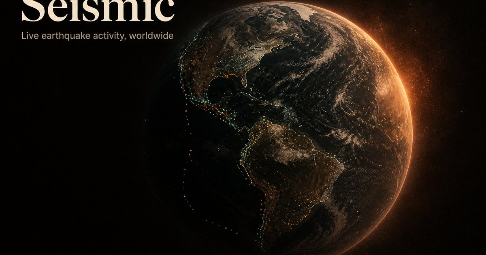

# Seismic

**Live earthquakes on a cinematic 3D globe.**

Real-time USGS data, custom GLSL markers, and an observatory-style HUD — built as a portfolio piece that still works as a real monitoring tool.

**[Live demo → seismic.center](https://seismic.center)**

[](https://seismic.center)
[](LICENSE)
[](https://react.dev)
[](https://threejs.org)
[](https://vite.dev)
[](https://www.typescriptlang.org)

<p align="center">
  
</p>

---

## Why this exists

Most earthquake maps are either utilitarian GIS tools or static screenshots. Seismic sits in between:

- A **full-bleed WebGL globe** you can orbit and fly into
- A **floating telemetry HUD** (not a dashboard grid fighting for space)
- **Live USGS feeds** with honest empty states, filters, and charts
- Polish that holds up as an **Awwwards-style** portfolio piece

No backend. No API keys. Open the app and you’re watching the planet.

---

## Features

| | |
|---|---|
| **Live globe** | USGS GeoJSON → instanced markers with custom bead shaders, glow, ripples, selection halo |
| **Fly-to** | Select an event → camera eases to the epicenter; screen-space label tracks the point |
| **Feeds** | Past hour / day / week / significant month — previous data kept while the next window loads |
| **Filters** | Min magnitude slider + tsunami-only |
| **Charts** | 24h activity timeline + magnitude distribution (visx) |
| **i18n + RTL** | English, French, Spanish, Arabic — layout mirrors with logical CSS |
| **Mobile** | Bottom sheet for feed/filters; reduced effects on small screens |
| **A11y** | `prefers-reduced-motion` pauses auto-rotate; muteable click sound; safe-area insets |
| **Zero config** | Client-side fetch from USGS — deploy as a static Vite site |

---

## Stack

- **React 19** + **TypeScript** + **Vite 8**
- **React Three Fiber** / **Drei** / **Three.js** — globe, cameras, shaders
- **Zustand** — UI selection / filter state
- **TanStack Query** — polling + `keepPreviousData` across feed switches
- **visx** + **d3** — charts
- **Framer Motion** — HUD motion
- **i18next** — locales + language detection
- **Tailwind CSS 4** — observatory tokens (copper / ember / warm void)

---

## Quick start

```bash
git clone https://github.com/Diallo222/Seismic.git
cd Seismic
npm install
npm run dev
```

Open the URL Vite prints (usually `http://localhost:5173`).

### Scripts

| Command | Description |
|---------|-------------|
| `npm run dev` | Dev server with HMR |
| `npm run build` | Typecheck + production build → `dist/` |
| `npm run preview` | Serve the production build locally |
| `npm run lint` | Oxlint |

### Requirements

- Node **20+** recommended
- Modern browser with WebGL 2

---

## How data works

```
USGS GeoJSON feed  ──poll ~60s──►  TanStack Query
                                       │
                                       ▼
                                 filter (mag / tsunami)
                                       │
                          ┌────────────┴────────────┐
                          ▼                         ▼
                     R3F globe                  HUD / charts
                   (markers, glow)            (feed, stats, detail)
```

Feeds come from the [USGS Earthquake Hazards Program](https://earthquake.usgs.gov/) public GeoJSON endpoints (hour / day / week / significant). Parsing and types live in `src/api/` and `src/lib/types.ts`.

**Credit:** U.S. Geological Survey. This project is not affiliated with USGS.

---

## Project structure

```
src/
  api/           USGS fetch, React Query hooks, new-quake diffing
  components/
    globe/       Canvas, Earth, markers, glow, ripples, camera rig
    hud/         Wordmark, rails, mobile sheet, lang / sound toggles
    dashboard/   Feed list, detail plate, stats
    charts/      Timeline + magnitude histogram
  shaders/       Atmosphere, marker, glow, ripple, selection (GLSL)
  i18n/          en · fr · es · ar
  store/         Zustand stores
  lib/           geo math, formatters, click sound, reduced-motion
public/
  textures/      Self-hosted Earth day map (no runtime CDN dependency)
```

---

## Deploy

Static site — works on **Vercel**, Netlify, Cloudflare Pages, GitHub Pages, etc.

**Vercel (what production uses):**

1. Import the repo
2. Framework: **Vite** · Build: `npm run build` · Output: `dist`
3. Point your domain (e.g. `seismic.center`)

If the public URL isn’t `https://seismic.center`, update:

- `index.html` — canonical, Open Graph, Twitter, JSON-LD
- `public/robots.txt`
- `public/sitemap.xml`

---

## Design notes

- Palette: warm void `#080706`, copper `#E0B07A`, ember `#C45C26`
- Type: **Fraunces** (display) + **IBM Plex Sans / Mono** (+ Arabic for RTL)
- HUD is pointer-events layered over a full-bleed canvas — the globe stays the hero
- Markers use additive custom shaders so magnitude reads as light, not just color dots

---

## Roadmap ideas

PRs welcome if you tackle any of these:

- [ ] Offline / stale-cache banner when USGS is unreachable
- [ ] Keyboard focus path onto globe markers
- [ ] Optional PWA install
- [ ] More locales
- [ ] Shareable deep-link to a selected event

---

## Contributing

1. Fork + branch from `main`
2. `npm install && npm run dev`
3. Keep changes focused; match the existing HUD language (logical CSS for RTL, Latin digits for mag/depth)
4. Open a PR with a short “why”

Issues for bugs and ideas are appreciated — especially if you include browser + GPU when reporting WebGL quirks.

---

## License

[MIT](LICENSE) — free to use, modify, and redistribute with attribution.

---

<p align="center">
  <b>Watch the Earth move.</b><br />
  <a href="https://seismic.center">seismic.center</a>
  ·
  <a href="https://github.com/Diallo222/Seismic">GitHub</a>
</p>
